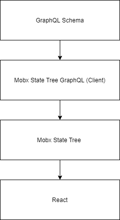

# Arsenal

+ [Mandatory tools](#mandatory-tools)
  + [Typescript](#typescript)
  + [Mobx State Tree](#mobx-state-tree)
  + [Webpack](#webpack)
  + [React](#react)
    + [(React) Styled Components](#react-styled-components)
  + [GraphQL](#graphql)
+ [Recommended tools](#recommended-tools)
  + [(React) Material UI](#react-material-ui)
  + [(React) - React Map Gl](#react---react-map-gl)
  + [(React) - React Deck.gl](#react---react-deckgl)
  + [Plotly](#plotly)
  + [Wendigo](#wendigo)
  + [Jest](#jest)

## Mandatory tools

|                                                |                                                                     |
| ---------------------------------------------- | ------------------------------------------------------------------- |
| **Typescript**                                 | https://www.typescriptlang.org                                      |
| **eslint-config-standard-typescript-prettier** | https://github.com/nfour/eslint-config-standard-typescript-prettier |
| **Webpack**                                    | https://webpack.js.org/configuration                                |
| **React**                                      | https://reactjs.org/docs/getting-started.html                       |
| **MobX State Tree**                            | https://mobx-state-tree.js.org/                                     |
| **StyledComponents**                           | https://styled-components.com                                       |
| **GraphQL**                                    | https://graphql.org/                                                |

### Typescript

- Becoming the industry standard
- Provides a baseline level of confidence
- Helps scale big projects
- Improves onboarding & cross-project context-switching costs

> Resources: https://github.com/typescript-cheatsheets

### Mobx State Tree

- Makes state management easy and low-complexity inside React
- Mobx ensures React rendering stays performant
- Establishes a convention to encapsulate business logic in a clear manner
- Can be wired up to GraphQL directly

### Webpack

- The leader in bundling tools
- Continues to learn from other tools and get better

### React

- Makes UI development deterministic
- Huge ecosystem full of useful libraries and guides

> Resources: https://github.com/typescript-cheatsheets/react-typescript-cheatsheet

#### (React) Styled Components

- Allows for styling to remain type-safe
- Allows for IDE CSS linting & autocomplete
- Currently the leader in CSS-in-JS solutions

### GraphQL

- Presents data in a way that is natural for UI development
- Large ecosystem full of tools and integrations
- Easy to use in the UI and server
- Facilitates easy mocking of data
- Provides schemas for clear contracts

## Recommended tools

|                  |                                       |
| ---------------- | ------------------------------------- |
| **MaterialUI**   | https://material-ui.com               |
| **React Map GL** | https://github.com/visgl/react-map-gl |
| **Deck GL**      | https://github.com/visgl/deck.gl      |
| **Plotly**       | https://github.com/plotly/plotly.js/  |
| **Jest**         | https://jestjs.io/                    |
| **Wendigo**      | https://github.com/angrykoala/wendigo |

### (React) Material UI

- Lots of useful components that look nice
- Large ecosystem and active community

### (React) - React Map Gl

- Decent mapbox wrapper library for declarative map configuration
- Decent community, backed by Uber, most active of its kind

### (React) - React Deck.gl

- Enhances mapbox declarative capabilities
- Supports useful visualization techniques

### Plotly

- Just a good graphing library

### Wendigo

- A nice and simple integration testing tool

### Jest

- The standard Javascript test runner as of 2020
