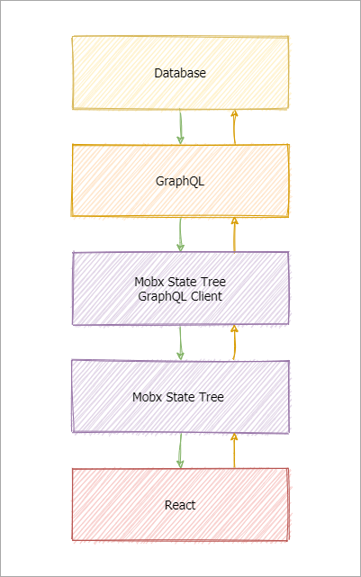

# Arsenal

+ [Core tools](#core-tools)
  + [Typescript](#typescript)
    + [Typescript cheatsheets](#typescript-cheatsheets)
  + [React](#react)
    + [React Typescript Cheat sheet](#react-typescript-cheat-sheet)
  + [Mobx State Tree](#mobx-state-tree)
    + [(LEARN) Manage Application State with Mobx-state-tree](#learn-manage-application-state-with-mobx-state-tree)
  + [MobX State Tree + GraphQL](#mobx-state-tree--graphql)
    + [(LEARN) The best GraphQL client you haven't heard of (mst-gql)](#learn-the-best-graphql-client-you-havent-heard-of-mst-gql)
  + [Webpack](#webpack)
  + [GraphQL](#graphql)
    + [(LEARN) GraphQL Basics - Build an app with the SpaceX API](#learn-graphql-basics---build-an-app-with-the-spacex-api)
  + [Styled Components (React)](#styled-components-react)
  + [Eslint config with Prettier](#eslint-config-with-prettier)
+ [Recommended tools](#recommended-tools)
  + [(React) Material UI](#react-material-ui)
  + [(React) React Map Gl](#react-react-map-gl)
  + [(React) React Deck.gl](#react-react-deckgl)
  + [Plotly](#plotly)
  + [Wendigo](#wendigo)
  + [Jest](#jest)

## Core tools

### Typescript

> https://www.typescriptlang.org

- Becoming the industry standard
- Provides a baseline level of confidence
- Helps scale big projects
- Improves onboarding & cross-project context-switching costs

#### Typescript cheatsheets

>  https://github.com/typescript-cheatsheets

### React

> https://reactjs.org/docs/getting-started.html

- The current industry leader for UI development
- Allows for UI to be expressed in a deterministic manner
- Huge ecosystem full of useful libraries and guides

#### React Typescript Cheat sheet

> https://github.com/typescript-cheatsheets/react-typescript-cheatsheet

### Mobx State Tree

> https://mobx-state-tree.js.org/

- Makes state management easy and low-complexity inside React
- Mobx ensures React rendering stays performant
- Establishes a convention to encapsulate business logic in a clear manner
- Can be wired up to GraphQL directly

#### (LEARN) Manage Application State with Mobx-state-tree

> https://egghead.io/courses/manage-application-state-with-mobx-state-tree

- A good overview of MST, by the creator of the library

### MobX State Tree + GraphQL

> https://github.com/mobxjs/mst-gql

- A client for GraphQL to marry a GQL server with your frontend state management

#### (LEARN) The best GraphQL client you haven't heard of (mst-gql)

> https://www.youtube.com/watch?v=N4ni8u47XVs

- This video first gives a conceptual overview of what mst-gql is, 
- Also shows how to create an example project

### Webpack

> https://webpack.js.org/configuration

- The leader in bundling tools
- Continues to learn from other tools and get better

### GraphQL

> https://graphql.org/

- Presents data in a way that is natural for UI development
- Large ecosystem full of tools and integrations
- Easy to use in the UI and server
- Facilitates easy mocking of data
- Provides schemas for clear contracts

#### (LEARN) GraphQL Basics - Build an app with the SpaceX API

> https://www.youtube.com/watch?v=7wzR4Ig5pTI

### Styled Components (React)

> https://styled-components.com

- Allows for styling to remain type-safe
- Allows for IDE CSS linting & autocomplete
- Currently the leader in CSS-in-JS solutions

### Eslint config with Prettier

> https://github.com/nfour/eslint-config-standard-typescript-prettier

- Configures linting with Eslint and Prettier in an easy manner
- Produces a good developer experience that allows for autoformatting our code 

--------------------------------------------------------

## Recommended tools

### (React) Material UI

> https://material-ui.com

- Lots of useful components that look nice
- Large ecosystem and active community

### (React) React Map Gl

> https://github.com/visgl/react-map-gl

- Decent mapbox wrapper library for declarative map configuration
- Decent community, backed by Uber, most active of its kind

### (React) React Deck.gl

> https://github.com/visgl/deck.gl

- Enhances mapbox declarative capabilities
- Supports useful visualization techniques

### Plotly

> https://github.com/plotly/plotly.js/

- A good, performant graphing library

### Wendigo

> https://github.com/angrykoala/wendigo

- A simple integration testing tool

### Jest

> https://jestjs.io/

- The standard Javascript test runner as of 2020
