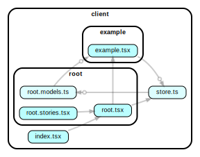

# React App

A minimal react single page app project

---

## Tech stack

|                            |                                               |
| -------------------------- | --------------------------------------------- |
| **React**                  | https://reactjs.org/docs/getting-started.html |
| **StyledComponents**       | https://styled-components.com                 |
| **TypeScript**             | https://www.typescriptlang.org                |
| **Webpack**                | https://webpack.js.org/configuration          |
| **MaterialUI**             | https://material-ui.com                       |
| **MobX State Tree**        | https://mobx-state-tree.js.org/               |
| **MobX React Lite**        | https://github.com/mobxjs/mobx-react-lite/    |

# Development Workflow

- Run `yarn dev` to start storybook
- Wait for it to build
- Hit `F5` in VSCode to spawn the debug version of chrome
- Add breakpoints and see them met inside VSCode!