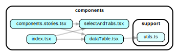

# React Components Library

A minimal react library project for publishing components to share



---

## Usage

Build then check that components are being exported correctly:
```
yarn build && yarn ts-node test/testBuiltComponentExports.ts

```

## NPM Release

The project builds to `./lib`.

```ts
// Example of extracting a single component
import { MyComponent } from '@dhi/webdev-arsenal/lib/MyComponent
```
